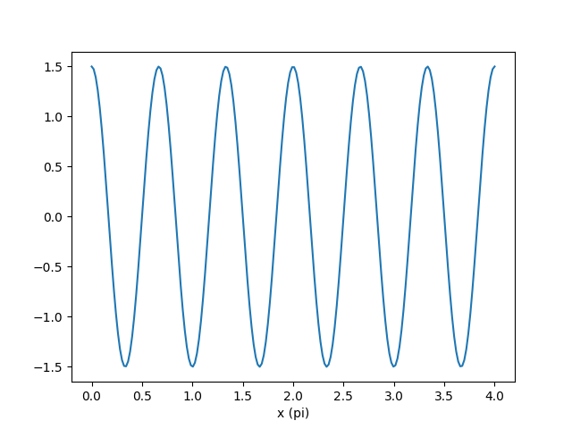
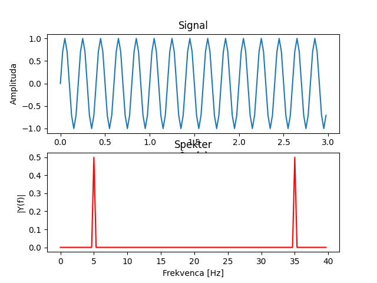
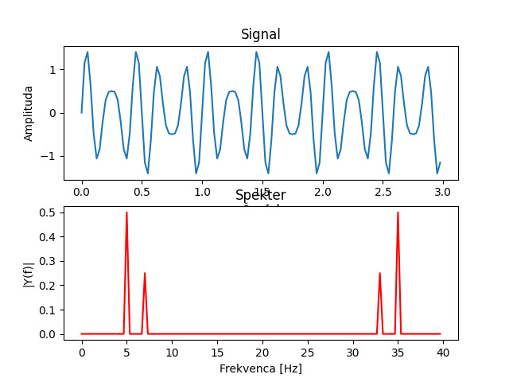

# Kolokvij 1

## Pred vprašanji

Simbol '*' za številko vprašanja namiguje na to, da vprašanje načeloma ni del predmeta, ampak koristi za boljše
razumevanje
ostalih vprašanj.

Vprašanja bolj ali manj zajemajo vso snov predavanj.

Priporočam tudi ogled videov in povezav podanih ob vprašanjih, saj ponujajo dobro razlago snovi in dodatno razumevanje.

Kratice:

## Vprašanja

1 Vrste signalov

```
Signale delimo na stohastične in determinisitčne. Stohastični signali so naključni - ne moremo jih opisati z neko
enačbo. Deterministične pa lahko. Deterministični signali se dalje delijo na periodične in neperiodične. 
Periodični pa se delijo naprej še na sinusoidne in ostale signale.
Večino signalov v naravi lahko tudi opišemo s kombinacijo sinusoid, tako da spreminjamo njihovo frekvenco, amplitudo,
fazo in prisotnost signala.
```

2 Določi parametre sinusoide



```
Frekvenca sinusoide je 3Hz, amplituda 1.5, faza pa 0.5pi.
```

3 Kaj nam omogoča DFT?

```
DFT nam omogoča, da iz nekega diskretnega signala dobimo informacije o najpomembnejših frekvencah prisotnih v signalu. 
Omogoča prehod iz časovne v frekvenčno domeno. Amplituda predstavlja moč frekvence, faza pa se izraža kot kot med
imaginarno in realno komponento.
```

4 Kaj je ortogonalnost sinusnih nihanj?

```
Če dve sinusoidi z isto frekvenco zmnožimo in seštejemo rezultate, dobimo od nič različen rezultat neglede na A in fazo.
Če pa imata različni frekvenci, dobimo 0.
```

5 Čemu prehod v frekvenčno domeno?

```
Prednost prehoda v frekvenčno domeno je, da ta uporablja manj parametrov za opis signala. Poleg tega pohitri nekatere
matematične operacije (konvolucija) in omogoča lažjo frekvenčno analizo signala. 

Vse to je mogoče, ker je vsak signal mogoče predstaviti kot kombinacijo sinusoid z različnimi frekvencami, amplitudami
in fazami.
```

Primer FFT 1:



```
Vzorčevalna frekvenca: 40Hz
Frekvenca sinusoide: 5Hz
Čas: 3s

Iz frekvenčnega prostora je jasno razvidno, da je glavna frekvenca v signalu 5Hz.
```

Primer FFT 2:



```
Vzorčevalna frekvenca: 40Hz
Frekvenca sinusoide 1: 5Hz
Frekvenca sinusoide 2: 7Hz
Čas: 3s

Iz frekvenčnega prostora je jasno razvidno, da sta glavni frekvenci v signalu 5Hz in 7Hz.
Slednja je prisotna z dvakrat manjšo amplitudo kot prva.
```
