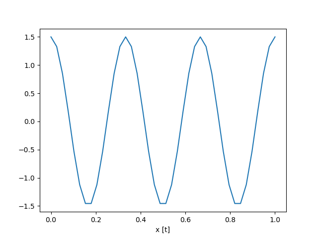
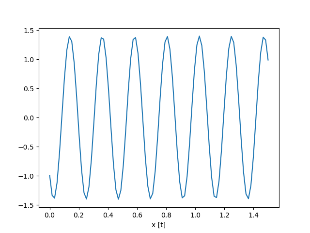

# Kolokvij 1

## Pred vprašanji

Simbol '*' za številko vprašanja namiguje na to, da vprašanje načeloma ni del predmeta, ampak koristi za boljše
razumevanje
ostalih vprašanj.

Vprašanja bolj ali manj zajemajo vso snov predavanj.

Priporočam tudi ogled videov in povezav podanih ob vprašanjih, saj ponujajo dobro razlago snovi in dodatno razumevanje.

Kratice:

* FT – Fourierjeva transformacija
* DFT – diskretna Fourierjeva transformacija
* FFT – hitra Fourierjeva transformacija

## Vprašanja

1 Vrste signalov

```
Signale delimo na stohastične in determinisitčne. Stohastični signali so naključni - ne moremo jih opisati z neko
enačbo. Deterministične pa lahko. Deterministični signali se dalje delijo na periodične in neperiodične. 
Periodični pa se delijo naprej še na sinusoidne in ostale signale.
Večino signalov v naravi lahko tudi opišemo s kombinacijo sinusoid, tako da spreminjamo njihovo frekvenco, amplitudo,
fazo in prisotnost signala.
```

2 Določi parametre sinusoide



```
Frekvenca sinusoide je 3Hz, amplituda 1.5, faza pa 0.5pi.
```



```
Amplituda je 1.4, faza je 1.25pi, frekvenca pa 4.5Hz.
```

3 Kaj nam omogoča DFT?

```
DFT nam omogoča, da iz nekega diskretnega signala dobimo informacije o najpomembnejših frekvencah prisotnih v signalu. 
Omogoča prehod iz časovne v frekvenčno domeno. Amplituda predstavlja moč frekvence, faza pa se izraža kot kot med
imaginarno in realno komponento.
```

4 Kaj je ortogonalnost sinusnih nihanj?

```
Če dve sinusoidi z isto frekvenco zmnožimo in seštejemo rezultate, dobimo od nič različen rezultat neglede na A in fazo.
Če pa imata različni frekvenci, dobimo 0.
```

5 Čemu prehod v frekvenčno domeno?

```
Prednost prehoda v frekvenčno domeno je, da ta uporablja manj parametrov za opis signala. Poleg tega pohitri nekatere
matematične operacije (konvolucija) in omogoča lažjo frekvenčno analizo signala, saj se omejimo na končno število
sinusoid. 

Vse to je mogoče, ker je vsak signal mogoče predstaviti kot kombinacijo sinusoid z različnimi frekvencami, amplitudami
in fazami.
```

Primer FFT 1:


```
Vzorčevalna frekvenca: 40Hz
Frekvenca sinusoide: 5Hz
Čas: 3s

Iz frekvenčnega prostora je jasno razvidno, da je glavna frekvenca v signalu 5Hz.
```

Primer FFT 2:


```
Vzorčevalna frekvenca: 40Hz
Frekvenca sinusoide 1: 5Hz
Frekvenca sinusoide 2: 7Hz
Čas: 3s

Iz frekvenčnega prostora je jasno razvidno, da sta glavni frekvenci v signalu 5Hz in 7Hz.
Slednja je prisotna z dvakrat manjšo amplitudo kot prva.
```

6 Kaj pa, če neka frekvenca ni prisotna ves čas?


```
Gre za isti signal kot pri prejšnjem primeru, le da je frekvenca 7Hz prisotna le v prvipolovici.
Na grafu se to izraža kot manjša amplituda pri frekvenci 7Hz in ustvarijo se hribčki okoli frekvence 7Hz.
Če pogledamo posebej imaginarno in realno komponento, dobimo slednje:
```


```
Te hribčki nastanejo zaradi frekvenčnega razlivanja. Rešitev za to so okna.
Iz realne komponente je razvidno, da se pri frekvenci 7 Hz nekaj zgodi.
Imaginarni graf pa točno prikazuje prisotnost frekvence 7Hz in 5Hz.
```


```
Tu recimo je bila dodana faza pi / 4. To se tudi vidi na realni osi.
Če namreč te faze ni, potlej je vrednost realne komponente 0.
```

7 Definicija Fourirjeve transformacije


```
S pomočjo uteži e^(-j2pi*n*f*t) lahko ugotovimo, pri kateri frekvenci, amplitudi in fazi se 
naš signal ujema s katero izmed sinusoid, ki tvorijo signal. 
```

8 Digitalizacija signala

```
Naša naloga je neke signale iz realnega sveta, ki so analogni, spraviti v naš digitalni svet.
Prva stopnja tega je diskretizacija - to dosežemo z vzorčenjem signala. Vzorčenje je 
"izmerjanje" signalov na določenih časovnih točkah. Frekvenci, s katero to delamo, rečemo
vzorčevalna frekvenca. Tako dobimo diskretne vrednosti - vrednosti kodiramo.
```

9 A/D pretvorba

```
A/D pretvorba je pretvorba analognega signala v digitalni. Za to poskrbi A/D pretvornik.
```

10 Nyquistov teorem

```
Nyquistov teorem pravi, da mora biti vzorčevalna frekvenca vsaj dva-krat večja od najvišje frekvence v signalu.
Načeloma si želimo, da bi bila vzorčevalna frekvenca čim večja, da signal "izgleda dobro".
Če ta teorem kršimo, potlej izmerjene vrednosti ne bodo več enake tistim, ki so v analognem signalu.
```

11 Bitna ločljivost

```
Bitna ločljivost je število bitov, ki jih uporabimo za predstavitev ene vzorčne vrednosti - število kvantizacijskih nivojev.
Če imamo 8-bitno ločljivost, to pomeni, da lahko amplitudo signala predstavimo na lestvici z 256 vrednostmi.
Slike npr. so pogosto 8-bitne, zvok pa ponavadi že 16-biten, da lahko predstavimo vse frekvence do 22050Hz.

Želimo si, da bi naš signal padel čim bolj v to območje!

Lahko bi rekli tudi, da bitna ločljivost predstavlja število stopničk v delavnem območju.
```

12 Delavno območje A/D pretvornika

```
Delavno območje nekega A/D pretvornika je območje, v katerem pretvornik "deluje". To je nek razpon vrednosti,
ki jih lahko pretvornik sprejme - gre za maksimalno in minimalno amplitudo. Če ima signal večjo amplitudo,
začnemo igubljati informacije o signalu. Temu se reče saturacija.

Nasproten problem pa je, da je aplituda signala prenizka in signal niha okoli 0. V tem primeru signal lahko 
izgleda kot da ga sploh nebi bilo, ker se pri diskretizaciji vrednosti signala pretvorijo v 0.

Rešitev za ta problem je ojačanje signala. Amplitudo signala spravimo na delovno območje A/D pretvornika tako, da 
signal ojačamo - mu zmanjšamo ali povečamo apmlitudo, da je blizu maksimalne ali minimalne vrednosti delavnega območja.
```

13 Dinamično ojačanje

```
Dinamično ojačanje samo pomeni, da se signal avtomatsko prilagaja delovnemu območju A/D pretvornika.

To je načeloma boljša opcija, kot pa povečanje bitne ločljivosti.

Problem pri tem pa je, da izgubimo informacije o amplitude signala. Ne vemo več npr.
kako glasen je bil zvok skozi čas, ker dobimo "enakomerno" glasnost.
```

14 Tipične vzorčevalne frekvence

```
44.1kHz: Audio
13.56MHz: Video
100Hz - 10kHz: Pospeškometri
```

15 Spektralno prekrivanje

```
Spektralno prekrivanje (aliasing) == kršenje Nyquistovega teorema:
1. Če imamo v signalu frekvence, katere niso prisotne vsaj eno periodo, pride do sprektralnega 
prekrivanja. Vzrok tega je ravno to, da je naš signal končen, FT pa ga obravnava kot neskončen.
Signal moramo zato navzgor omejiti s filtrom, lahko pa tudi z oknom.
---> Nizkoprepustni filter
2. Problem pa nastane tudi, ko je kršen Nyquistov teorem. V tem primeru se v izmerjenem
signalu pojavijo frekvence, ki v resnici v signalu niso prisotne. To lahko ponovno rešimo
z uporabo filtra.

---> Nastanejo navidezne frekvence
```

16 Kvantizacija

```
Kvantni noviji so vrednosti na lestvici, ki jo uporabimo za predstavitev ene vzorčne vrednosti.
A/D pretvorniki ne zaokrožujejo, temveč vzamejo spodnjo vrednost.
Pri tem seveda nastane kvantizacijska napaka, ki je odvisna od bitne ločljivosti.
Kvantizacijska napaka: (delovno območje) / (2^bitna_ločljivost)
Ta nastane, ker ne vzamemo dejanske analogne vrednosti, temveč nek vzorec - kvant - ki pa je diskreten.
```

Primer kvantizacije:


17 Zasnova A/D pretvornika

```
Najprej imamo signal. Signalu sledi nizkopreustni filter. Ta sfiltrira višje frekvence, ki bi sicer
kršile Nyquistov teorem. Temu sledi še ojačevalnik, ki pa skrbi za to, da signal ostane znotraj
delavnega območja. Potlej imamo še nek buffer, ki zadžuje signal, dokler ga ne obdela A/D pretvornik.
Temu bufferju rečemo vzorčevalno-zadrževalno vezje. Rabimo ga pač, ker pridobivanje vzorca nekaj
časa traja...
Nato imamo A/D ppretvornik, ki pa poskrbi za diskretizacijo (tu je pomembna vzorčevalna frekvenca,
bitna ločljivost...). Na izhodu nato dobimo diskretiziran signal, ki pa ga lahko shranimo v 
pomnilnik za nadaljno analizo.
```

18 Napake pri A/D pretvorbi

```
Prenizka vzorčevalna frekvenca vodi v **sprektralno prekrivanje**. Ta je določena kot:
Fvz = 1/t
kjer je t čas pretvorbe enega vzorca. Poleg tega moramo kot omenjeno dodati nizkoprepustni filter,
da ni kršen Nyquistov teorem.

Napako, ki pri tem nastane imenujemo kvantizacijska napaka (napaka LSB). Velika je:
(razpon n-bitneega A/D) / 2^n

Imamo še napako zaradi neenakomernega vzorčenja - trepetanje in napako rekostrukcije signala D/A.
Probleem pri slednjem je, da nimamo idelanega filtra, ki bi čisto izločil osnovni spekter signala.
```

19 Operacije nad signali

```
Operacije, ki jih lahko izvajamo nad signali so:
* seštevanje,
* množenje,
* množenje s konstanto...

Primer množenja dveh signalov je tudi konvolucija. Je tudi linearna transformacija, kar pomeni, da 
zanjo veljajo: komutativnost, ...
```

20 Linearni sistem

```
Linearni sistem je sistem, za katerega velja, da sprejme nek vhod in vrne neko izhodno vrednost. 
Pri tem ohranja linearnost: komutativnost, ...
```

21 Konvolucija 1

```
Kovolucija je množenje in seštevanje dveh signalov. Če nad signalom x izvajamo konvolucijo s signalom
h, potlej to pomeni, da za vsak indeks v signalu x izvedemo množenje s signalom h, ki je ponavadi
krajši od signala x.
```

Primer konvolucije med signalom x in alfa

```
y(n) = sigma(i = 0 do n) alfa[i] x(n - i)
```

Enačba za konvolucijo:


```
h - impulzni odziv sistema
x - vhodni signal
y - izhodni signal

Enačba konvolucije v diskretnem prostoru se omeji na neko omejeno dolžino signalov.
```

22 Pojem sistema

```
Sistem si lahko predstavljamo tudi kot črno škatlo. Ne vemo, kaj se v njem dogaja. Noter damo signal
in ven dobimo nov signal. Delovanje sistema lahko opišemo s pomočjo impulza. To je Diracov oz. 
enotski impulz. Gre za signal, kjer imamo samo eno vrednost (ponavadi prvo) na vrednosti ena, ostale 0
in jo pošljemo čez sistem. Dobimo impulzni odziv. Le-ta nam pove obnašanje tega sistema - torej
kaj sistem naredi s signalom. Z uporabo impulznega odziva in kovolucije lahko nato posnemamo
tak sistem.
```

23 Konvolucija 2

```
Kot omenjeno lahko s pomočjo konvolucije tvorimo signal, ki bi ga dobili, če bi ga spustili v nek 
sistem. Pred tem seveda rabimo impulzni odziv tega sistema.
```

Program za izvajanje konvolucije:

```
x - vhodni signal dolžine n (vrednosti pred nulo so 0)
h - impulzni odziv sistema dolžine m
y - izhodni signal dolžine n + m - 1
```

```python
for i in range(n):
    for j in range(m):
        y[i] += x[i - j] * h[j]  # Tule predpostavljamo, da je x[i - j] = 0, če je i - j < 0
```

24 Konvolucija 3 - linearnost

```
To, da je konvolucija linearna, pomeni, da zanjo veljajo naslednje lastnosti:
* komutativnost: y = x * h = h * x
* asociativnost: y = (x * h) * g = x * (h * g)
* distributivnost: y = x * (h + g) = x * h + x * g
```

25 Konvolucija 4 - frekvenčna domena

```
Razlog, da konvoluciji opravimo v frekvenčni domeni je, ker je to dosti hitrejše. Časovna kompleksnost
pade iz O(n^2) na O(n logn). Namesto, da za vsako vrednost signala x množimo z impulznim odzivom, 
se s pomočjo Fourirjeve transformacije premaknemo v frekvenčno domeni in tam le zmnožimo signal
in impulzni odziv! To je dosti hitrejše!
```

26 Lastnosti sistemov

```
Stabilnost: sistem je stabilen, če je njegov impulzni odziv končen.

Vzorčenost: izhod sistema je odvisen samo od trenutnega in preteklih vhodov.

Linearnost: veljasti mora slednje za x1(n), x2(n):
a * S(x1(n)) + b * S(x2(n)) = S(a * x1(n) + b * x2(n))

Časovna neodvisnost:
x(n) --> y(n) in za x(n - k) --> y(n - k) za vsak poljuben k
```

27 Lastnosti linearne transformacije

```
Glavna ideja je, da ta velja tako za konvolucji, kot za DFT. Poleg tega velja tako v 2D
kot tudi v 3D. Imamo svobodo izbire: signal lahko razbijemo na več signalov, ter vsakega
posebej obdelamo in nato združimo ipd.
```

28 Časovna neodvisnost konvolucije in DFT?

```
Glej vprašanje 26.
```

29 Impulzni odziv in stabilizacija konvolucije

```
Stabilizacija konvolucije: Za impulzni odziv velja, da je končno velik.

! Pri konvoluciji je impulzni odziv časovno neodvisen, se ne spreminja, spreminja pa se 
izhod sistema.
```

30 Fourirjeva transformacija

```
Fourirjeva transformacija je v osnovi zvezna, kar pomeni, da operira z realnimi vrednostmi.
Ker pa vemo, da pri računalniku to ne gre, uvedemo diskretno Fourirjevo transformacijo (DFT).
Predpostavlja tudi, da je signal neskončen, da se ponavlja.

Tu pa nastanejo problemi...

Spektralno prekrivanje (spectral aliasing) == kršenje Nyquistovega teorema:
1. Če imamo v signalu frekvence, katere niso prisotne vsaj eno periodo, pride do sprektralnega 
razlivanja. Vzrok tega je ravno to, da je naš signal končen, FT pa ga obravnava kot neskončen.
Signal moramo zato navzgor omejiti s filtrom, lahko pa tudi z oknom.
---> Nizkoprepustni filter
2. Problem pa nastane tudi, ko je kršen Nyquistov teorem. V tem primeru se v izmerjenem
signalu pojavijo frekvence, ki v resnici v signalu niso prisotne. To lahko ponovno rešimo
z uporabo filtra.

Spektralno razlivanje:**
1. Tu gre za problem razločevanja med frekvencami, kjer imamo več zelo podobnih frekvenc,
ali pa morda imajo nekatere zelo nizko amplitudo.
2. To se pojavi tudi takrat, ko imaom v signalu necele frekvence. Signal se po DFT
razlije med druge frekvence.

Namen Fourirjeve transofrmacije je, da iz signalov v časovni domeni dobimo njihove frekvenčne
komponente. Porabimo manj podatkov za opis signala in lahko lažje analiziramo signal za
prisotnost frekvenčnih komponent.

Kot že omenjeno, s tem tudi pohitrimo izračun konvolucije in še marsičesa.
```

** Tule nisem čisto gotov, ker ne vem točnega prevoda za ta izraz

31 Kovolucija v frekvenčni domeni

```
Kovolucija v frekvenčni domeni je enaka konvoluciji v časovni domeni. Vendar pa je časovna
kompleksnost O(n logn), kar je veliko hitrejše.
```

32 Nizko in visoko prepustni filter

```
Nizko prepustni filter: omogoča prehod le nizkih frekvenc, visoke pa blokira.
Visoko prepustni filter: omogoča prehod le visokih frekvenc, nizke pa blokira.
```

33 Konvolucija in FFT
    
```
Kot že omenjeno, je konvolucija v frekvenčni domeni enaka konvoluciji v časovni domeni.
Velika razlika pa je v časovni kompleksnosti. Časovna kompleksnost konvolucije v časovni
domeni je O(n^2), v frekvenčni pa O(n logn). To je veliko hitrejše.

Časovna domena:    y(n) = sigma x(n) * h(n - k)
      |
      | FFT  O(n logn)
      V
Frekvenčna domena:    Y(k) = X(k) * H(k)  -->  Pohitritev!  O(n)
      |
      | IFFT  O(n logn)
      V
Prvoten signal

Povezava med impulznim in frekvenčnim odzivom je v FFT.
... Elaborate more on this ... page 40, 41
```

34 Iz FT v DFT v FFT

```
Iz Fourirjeve transformacije pridemo do diskretne Fourirjeve transformacije (DFT) tako,
da čas in frekvenco diskretiziramo. Torej omejimo se na nek razpon vrednosti.
FFT pa je samo pohitritev DFT, ki deluje po principu deli in vladaj.
```


35 Resolucija DFT

```
Nekateri pojmi:
Krožna frekvenca: 𝛥𝜔 = 2𝜋𝛥𝑓
Frekvenca vzorčenja: 𝛥𝑓 = 2𝜋 / 𝑁Δt

Resolucija DFT oz. frekvenčni interval oz. frekvenčni korak je razmik med dvema frekvencama v **frekvenčni domeni**.
Izračunamo ga na sledeč način:
𝛥𝑓 = 1 / 𝑁Δt 
oz.
𝛥𝑓 = 1 / 𝑇
kjer je T dolžina signala (v sekundah), Δt pa je razmik med vzorci pri vzorčenju in N število
vseh vzorcev v **časovni domeni**.

Velja tudi:
𝛥𝑓 = 𝛥𝜔 / 2𝜋
in
𝛥𝑓 = Fvz / N
kje je Fvz frekvenca vzorčenja in N število vseh vzorcev v **časovni domeni**.

Primer izračuna:
Δt = 0.001s
N = 2100
𝛥𝑓 = 1 / (2100 * 0.001) = 0.4762 Hz
```

36 Enačba Fourirjeve transformacije


```
Ničta vrednost predstavlja frekvenco nič!
Zato s štetjem frekvenc v bistvu začneš pri 1...

Dolžina DFT transformiranke je enaka originalnemu signalu!
```

In pa še inverzna Fourirjeva transformacija:


37 Vsebina DFT transformiranke

```
Rezultat DFT transformiranke je v dveh delih: v imaginarem in realnem delu. Torej je predstavljen
v kartezičnem koordinatnem sistemu. Sinus pripada imaginarni osi, kosinus pa realni. Kot
med tema dvema osema pa predstavlja fazo.
```

38 Razlivanje/prepuščanje DFT - spektralno razlivanje

```
Kadar v DFT pošljemo frekvence, ki pa ne sovpadajo z razdelki DFT, takrat pride do razlivanja
frekvence po sosednjih razdelkih.
```

39 Vsebina Fourirjeve transformacije

```
S pomočjo vrednosti na imaginarni in realni osi lahko poleg frekvenc izračunamo tudi amplitudo
in fazo te frekvence. 
Amplitudo dobimo s sledečo enačbo:
A[f] = sqrt(Re(X[f])² + Im(X[f])²)
Fazo pa:
p[f] = arctg(Im(X[f]) / Re(X[f]))
```


40 Časovna zahtevnost DFT in FFT

```
Časovna zahtevnost DFT je O(n²), FFT pa O(n logn). FFT to pohitritev doseže s strategijo
deli in vladaj tako, da upošteva dejstvo, da se nekatere frekvence na določenih
mestih ujemajo, ko izračunavamo DFT, in jih ni potrebno ponovno računati (recimo frekvence
večkratnikov števila 2 - od tu logn).
```

41 Lastnosti DFT

```
Linearnost:
za x1(n), x2(n), a in b: a * DFT[x1(n)] + b * DFT[x2(n)] = DFT[a * x1(n) + b * x2(n)]

Simetričnost za realne signale (glej sliko pri vprašanju 6):
če DFT[x(n)] = X(k) → Re[X(k)], |X(k)| – simetrično
Im[X(k)], arg[X(k)] – antisimetrično
TL;DR: Amplituda je simetrična, faza pa antisimetrična**

Pomik (cikličen):
če DFT[x(n)] = X(k) → DFT[x(n-m)] = (WN) - m * X(k), kadar n=0, ..., N-1

Razlivanje (glej vprašanje 38)
```

42 Konvolucija: časovna vs. frekvenčna domena**

```
Konvolucija je simetrična glede na domeni
```

** To vprašanje bo treba še dopolniti.

43 Računanje konvolucije v časovni domeni

```
-1  0  1  -> impulzni odziv h
 1  0  2  1  0  -> vzorec x
 
Preobrazimo h v (ga obrnemo):
 1  0  -1

X nato obdamo z ničlami spredaj (da poenostavimo računanje) in zadaj, zato da dobimo celoten signal:
 0  0  1  0  2  1  0  0  0

Nato sledi postopek kovolucije:
 0  0  1  0  2  1  0  0  0
 1  0 -1
    1  0 -1
       1  0 -1
          1  0 -1
             1  0 -1
                1  0 -1
                   1  0 -1
--------------------------
      -1  0 -1 -1  2  1  0
      
To, kolikšen izhodni signal dobimo je odvisno tudi od tip konvolucije: v primeru zgoraj gre za polno
konovlucijo. Če bi šlo za konvolucijo tipa "same", bi odrezali zadnji dve vrednosti izhodnega signala.
```

44 Računanje impulznega odziva sistema

```
Recimo, da imamo sistem:
y(n) = 0.5 * x(n) + 0.25 * x(n-1) + 0.125 * x(n-2)
in impulz:
x(n) = [1, 0, 0]

Izračunajmo impulzni odziv sistema (isti postopek kot konvolucija, samo da uporabimo impulz
namesto impulznega odziva) za n = 0, 1, 2:

 n = 0:
  h(0) = y(0) 
       = 0.5 * x(0) + 0.25 * x(-1) + 0.125 * x(-2)
       = 0.5 * 1 + 0.25 * 0 + 0.125 * 0
       = 0.5  -> a0

 n = 1:
  h(1) = y(1) 
       = 0.5 * x(1) + 0.25 * x(0) + 0.125 * x(-1)
       = 0.5 * 0 + 0.25 * 1 + 0.125 * 0
       = 0.25  -> a1

 n = 2:
  h(2) = y(2) 
       = 0.5 * x(2) + 0.25 * x(1) + 0.125 * x(0)
       = 0.5 * 0 + 0.25 * 0 + 0.125 * 1
       = 0.125  -> a2
       
Dobimo impulzni odziva sistema:
h = [a0, a1, a2] = [0.5, 0.25, 0.125]

Tako brez da bi poznali sistem, lahko izračunamo njegov impulzni odziv, ki pa nam v bistvu pove,
kaj sistem s signalom naredi. Črna škatla postane bela škatla. V praksi bi rabili dolžina impulza
prilagoditi namesto da dodaš ničle.

Daljši impulz kot imamo, bolj natančen opis sistema dobimo.
```

45 Psevdokod konvolucije v časovni domeni

```pseudocode
for n = 0, ..., N-1:
  y[n] = 0
  for m = 0, ..., M-1:
    y[n] += x[n-m] * h[m]
```

46 Psevdokod DFT

```pseudocode
for k = 0, ..., N-1:
  X[k] = 0
  for n = 0, ..., N-1:
    X[k] += x[n] * exp(-j * 2 * pi * k * n / N)
```
